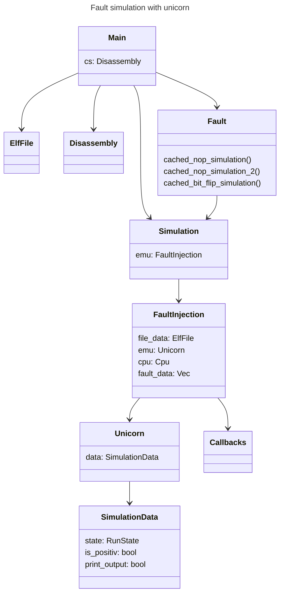

```mermaid

---
title: Fault simulation with unicorn
---
classDiagram
    Main --> ElfFile
    Main --> Simulation
    Main --> Disassembly
    Main --> Fault
    Simulation --> FaultInjection
    Fault --> Simulation
    FaultInjection --> Unicorn
    FaultInjection --> Callbacks
    Unicorn --> SimulationData
    class Main {
        cs: Disassembly
    }
    class Simulation{
        emu: FaultInjection
    }
    class FaultInjection{
        file_data: ElfFile
        emu: Unicorn
        cpu: Cpu
        fault_data: Vec<FaultData>
    }
    class Unicorn{
        data: SimulationData
    }
    class ElfFile{
    }
    class SimulationData{
        state: RunState
        is_positiv: bool
        print_output: bool
    }
    class Callbacks{

    }
    class Disassembly{

    }
    class Fault{
        cached_nop_simulation()
        cached_nop_simulation_2()
        cached_bit_flip_simulation()
    }

```
