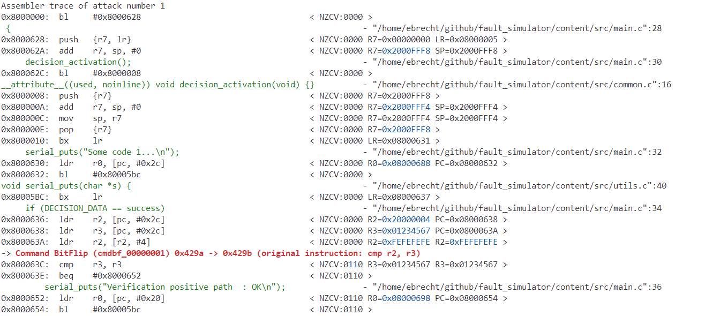
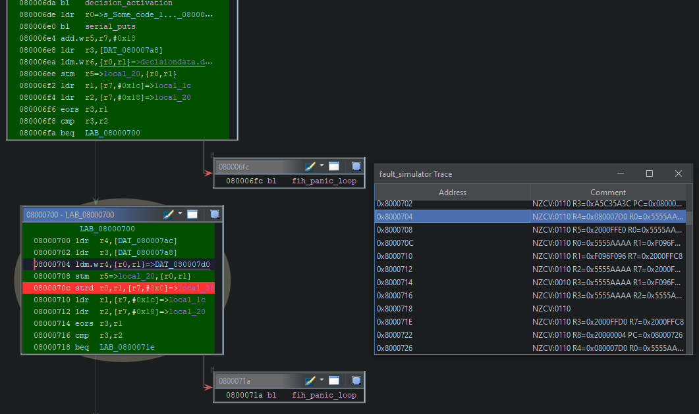

# Fault Simulator
This project is used as a tool to simulate fault attacks to ARM-M processors (Thumb mode).

The simulator supports two modes of operation:
1. **C Project Mode**: Compile and test the included C project from the "content" folder
2. **Firmware Mode**: Load and instrument an independent ELF file (e.g., real firmware binaries) with custom memory regions, code patches, and register initialization

Faults are introduces depending the predefined ranges or manualy. For the simulated attacks "all", "single" and "double", all implemented faults are executed till one leads to an successful attack.
(e.g. "--class double"). For specific cases the check of the C code operation can be disabled with the "--no-check" option. This will allow to remove for e.g. the SUCCESS_DATA from the file under attack.

Once a vulnerability is found, the attack command sequence can be further analyzed using the '--analysis' command line parameter.


*Screenshot of the attack visualization with highlighted instructions.*

For fast reproduction of a successful attack, the faults can be setup with the --faults feature manualy.
(E.g. *"--faults glitch_1 glitch_10"* -a double attack with 1 and 10 instruction glitches)
Code examples for main.c are located at: "content\src\examples"

## Implemented Attacks

### 1. Glitch
Inject a program counter (PC) glitch (skips 1–10 assembly instructions).

**Syntax:**
- Attack class: `glitch`
- Specific attacks: `glitch_1`, `glitch_2`, ..., `glitch_10`

**Example:**
```bash
glitch_3  # Skips 3 instructions
```

### 2. Register Bit Flip (regbf)
Flip bits in registers R0–R12 using XOR with a hex mask (single-bit only).

**Syntax:**
- Attack class: `regbf`
- Specific attacks: `regbf_rX_YYYYYYYY` (X=0–12, Y=hex mask)

**Examples:**
```bash
regbf_r0_00000001  # Flip bit 0 of R0
regbf_r12_80000000  # Flip bit 31 of R12
```

### 3. Register Flood (regfld)
Flood a register with `0x00000000` or `0xFFFFFFFF`.

**Syntax:**
- Attack class: `regfld`
- Specific attacks: `regfld_rX_00000000`, `regfld_rX_FFFFFFFF`

**Example:**
```bash
regfld_r5_FFFFFFFF  # Set R5 to 0xFFFFFFFF
```

### 4. Command Fetch Bit Flip (cmdbf)
Flip bits in instructions during fetch (single-bit only).

**Syntax:**
- Attack class: `cmdbf`
- Specific attacks: `cmdbf_YYYYYYYY` (Y=hex mask)

**Example:**
```bash
cmdbf_00000001  # Flip bit 0 of the fetched instruction
```

## Compiler Configuration

The included C project (`/content`) is compiled with these flags:

```make
TARGET = armv8-m.main

CFLAGS = -c -O3 -Iinclude \
         -g -gdwarf -Wno-unused-but-set-variable -fno-inline -fno-omit-frame-pointer \
         -fno-ipa-cp-clone -fno-ipa-cp -fno-common -fno-builtin -ffreestanding -fno-stack-protector \
         -Wall -Wno-format-security -Wno-format-nonliteral -Wno-return-local-addr -Wno-int-to-pointer-cast \
         -march=$(TARGET) -DMCUBOOT_FIH_PROFILE_ON -DMCUBOOT_FIH_PROFILE_HIGH -DFAULT_INJECTION_TEST

CFLAGS_LD = -N -Wl,--build-id=none -g -gdwarf -Os -Wno-unused-but-set-variable \
            -Wno-return-local-addr -fno-inline -fno-ipa-cp-clone \
            -fno-ipa-cp -nostartfiles -nodefaultlibs
```

## Setup / Requirements
**Rust Toolchain**
- Included crates:
  - `unicorn-engine`
  - `elf`
  - `log`
  - `env_logger`
  - `capstone`
  - `indicatif`
  - `git-version`
  - `rayon`
  - `itertools`
  - `clap`
  - `serde`
  - `serder_json`

**Compiler Toolchain**
- `gcc-arm-none-eabi` compiler toolchain

**Build Tools**
- `make` toolchain

**Ghidra Trace Visualization**
- Ghidra 11.3 or newer with PyGhidra mode.

## Usage

You can configure the simulator using either command-line arguments or a JSON5 config file.  
CLI arguments always override values from the config file.

### Command-Line Options
| Flag/Option                    | Description |
|--------------------------------|-------------|
| `-c, --config <CONFIG>`             | Load configuration from JSON file |
| `-t, --threads <THREADS>`      | Number of threads started in parallel [default: 1]. "-t 0" activate full thread usage |
| `-n, --no-compilation`         | Suppress re-compilation of target program |
| `--class <ATTACK>,<GROUPS>`    | Attack class to be executed. Possible values are: all, single, double [default: all]. GROUPS can be the names of the implemented attacks. E.g. --class single regbf separated by ' ' |
| `--faults <FAULTS>`            | Run a command line defined sequence of faults. Alternative to --attack. (E.g. --faults glitch_1 glitch_10). Current implemented fault attacks: <br> - glitch_1 .. glitch_10 <br> - regbf_r0_00000001 .. regbf_r12_80000000 <br> - regfld_r0_00000000 or regfld_r0_FFFFFFFF <br> - cmdbf_00000000 .. cmdbf_80000000 |
| `-a, --analysis`               | Activate trace analysis of picked fault |
| `-d, --deep-analysis`          | Check with deep analysis scan. Repeated code (e.g. loops) are fully analysed |
| `-m, --max_instructions`       | Maximum number of instructions to be executed. Required for longer code under investigation (Default value: 2000) |
| `--no_check`                   | Disable program flow check |
| `-e, --elf <FILE>`             | Use external elf file w/o compilation step |
| `--trace`                      | Trace and analyse program w/o fault injection |
| `-r, --run-through`            | Don't stop on first successful fault injection |
| `--print-unicorn-errors`       | Enable printing of Unicorn engine memory errors (useful for debugging) |
| `--success-addresses [<SUCCESS_ADDRESSES>...]` | List of memory addresses that indicate success when accessed Format: --success-addresses 0x8000123 0x8000456 |
| `--failure-addresses [<FAILURE_ADDRESSES>...]` | List of memory addresses that indicate failure when accessed Format: --failure-addresses 0x8000789 0x8000abc |
| `-h, --help`                   | Print help |
| `-V, --version`                | Print version |

### Examples

1. **Single glitch attack with trace analysis (CLI):**
   ```bash
   cargo run -- --class single glitch --analysis
   ```  

2. **Single glitch attack with trace analysis (JSON5 config):**
   Create a file (e.g., `example.json5`):
   ```json5
   {
     class: ["single", "glitch"],
     analysis: true,
   }
   ```
   Run with:
   ```bash
   cargo run -- --config example.json5
   ```

3. **Mixing CLI and JSON5:**
   ```bash
   cargo run -- --config example.json5 --analysis false
   ```

4. **Double attack (glitch + register flood) on custom ELF:**
   ```bash
   cargo run -- --class double glitch regfld --elf tests/bin/victim.elf -t 4
   ```

5. **Running a fault sequence with register bit-flip and glitch:**
   ```bash
   cargo run -- --faults regbf_r1_0100 glitch_1
   ```

6. **Running with custom initial register context:**
   Create a config file (`custom_context.json5`):
   ```json5
   {
     elf: "tests/bin/victim_3.elf",
     class: ["single", "glitch"],
     analysis: true,
     initial_registers: {
       R0: "0x12345678",  // Custom value
       R7: "0x2000FFF8",  // Frame pointer
       SP: "0x2000FFF8",  // Stack pointer
       LR: "0x08000005",  // Link register
       PC: "0x08000620",  // Program counter - entry point
     },
   }
   ```
   Run with:
   ```bash
   cargo run -- --config custom_context.json5
   ```

**Supported registers:** R0-R12, SP, LR, PC, CPSR  
**Value formats:** Hex strings (`"0x12345678"`) or decimal numbers (`42`)  
**Case insensitive:** `"r0"`, `"R0"`, `"sp"`, `"SP"` all work

### JSON5 Configuration Options
The following features are only available using hte JSON5 configuration file.
#### Code Patches
Apply binary patches to modify firmware behavior at specific addresses or symbols. Useful for bypassing security functions or modifying control flow.

```json5
{
  code_patches: [
    // Patch function to return immediately (bx lr)
    {
      symbol: "decision_activation",
      data: "0x4770",
    },
    // Patch at offset from symbol (symbol address + offset)
    {
      symbol: "check_secret",
      offset: "0x10",
      data: "0x2001",  // movs r0, #1
    },
    // Replace function with bx lr (immediate return)
    {
      address: "0x08000100",
      data: "0x4770",
    },
    // Replace instruction with nop; nop
    {
      address: "0x08000200",
      data: "0xbf00bf00",
    },
  ],
}
```

**Fields:**
- `address` (string, optional): Memory address to patch (hex format) - use either `address` or `symbol`
- `symbol` (string, optional): Symbol name to patch (resolved from ELF symbol table) - use either `address` or `symbol`
- `offset` (string, optional): Hex offset to add to the symbol address (only used with `symbol`, defaults to 0)
- `data` (string): Hex data to write at the address

**Note:** Each patch must specify either `address` OR `symbol`, but not both. When using `symbol`, you can optionally specify an `offset` to patch at a location relative to the symbol address. Using symbols makes configurations more portable across firmware versions.

#### Memory Regions
Define custom memory regions with optional data loading from files. Essential for firmware that expects specific memory layouts (SRAM, peripherals, flash).

```json5
{
  memory_regions: [
    // SRAM region
    {
      address: "0x20000000",  // SRAM base
      size: "0x20000",        // 128 KB
    },
    // Peripheral registers initialized from file
    {
      address: "0x40000000",  // Peripheral base
      size: "0x10000",        // 64 KB
      file: "peripheral_data.bin",
    },
    // Memory region with inline hex data
    {
      address: "0x30000000",
      size: "0x1000",
      data: "0xDEADBEEF",  // Inline hex value to initialize region
    },
  ],
}
```

**Fields:**
- `address` (string): Starting address of the memory region (hex format)
- `size` (string): Size of the region in bytes (hex format)
- `file` (string, optional): Binary file to load into this region
- `data` (string, optional): Hex value to initialize the region with (e.g., "0xDEADBEEF")


## Ghidra Visualization

The Ghidra script you created enhances the visualization of the trace output generated by the simulator with the `-a, --analysis` option. 

**Usage:**

1.  Ensure Ghidra 11.3 or newer is installed and running in PyGhidra mode as described in the [Ghidra Installation Guide](https://github.com/NationalSecurityAgency/ghidra/blob/Ghidra_11.3_build/GhidraDocs/InstallationGuide.md#pyghidra-mode).
2. Start the script in Ghidra.
3. Paste the trace output from the simulation.
4. Observe the executed instructions highlighted in green and the faulted instruction in red.
5. Use the table window to step through the instruction trace.

**Visualization Example:**


*Screenshot of the Ghidra visualization with highlighted instructions.*
