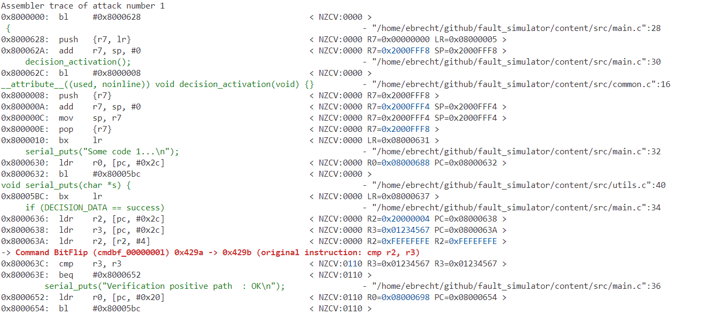
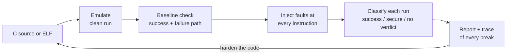
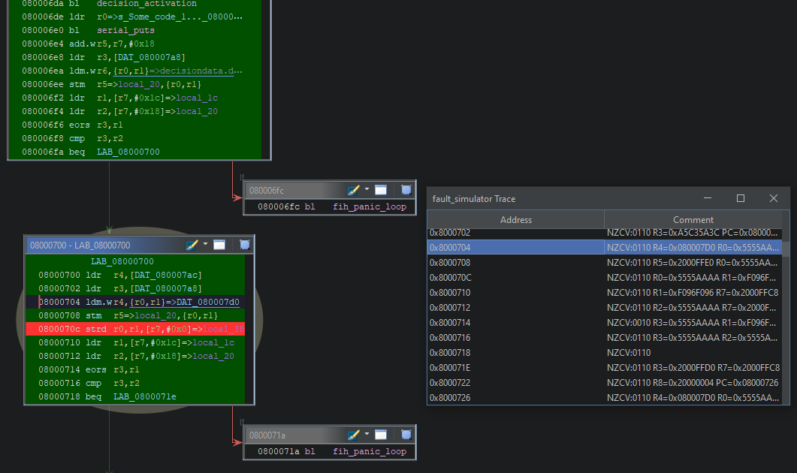

<div align="center">

# ⚡ Fault Simulator

**Find fault-injection vulnerabilities in ARM Cortex-M firmware — before an attacker does.**

A multi-threaded fault attack simulator for ARMv8-M (Thumb) code. It emulates the target,
injects glitches, register and instruction faults at every possible point of the execution,
and reports every fault sequence that breaks the security decision.

[](https://github.com/tigger1005/fault_simulator/actions/workflows/rust.yml)
[](LICENSE)




</div>

---

## Table of Contents

- [Why](#why) · [How it works](#how-it-works) · [Quick start](#quick-start)
- [Fault models](#fault-models) · [Command line](#command-line) · [Recipes](#recipes)
- [Configuration file](#configuration-file-json5) · [Diagnostics](#diagnostics)
- [Ghidra visualization](#ghidra-visualization) · [AI integration (MCP)](#ai-integration-mcp)
- [Project layout](#project-layout) · [Further reading](#further-reading)

---

## Why

Voltage and clock glitches, EM pulses and laser shots make a CPU skip instructions or
corrupt registers. A single such fault can turn a rejected signature into an accepted one.
This simulator reproduces those effects deterministically, so you can

- **measure** how many faults it takes to break a security decision,
- **see exactly which instruction** was faulted and why the attack works,
- **verify hardening** by re-running the identical campaign after every code change.

Two ways to use it:

| Mode | Use it for | How |
|---|---|---|
| **C project mode** | Developing and hardening a routine from source | Edit `content/src/main.c`; the simulator compiles it for you |
| **Firmware mode** | Auditing an existing binary, with or without sources | `--elf firmware.elf` plus memory regions, register context and code patches |

---

## How it works


```mermaid
flowchart LR
    A[C source or ELF] --> B[Emulate<br/>clean run]
    B --> C[Baseline check<br/>success + failure path]
    C --> D[Inject faults at<br/>every instruction]
    D --> E[Classify each run<br/>success / secure / no verdict]
    E --> F[Report + trace<br/>of every break]
    F -->|harden the code| A
```

1. **Baseline check** — the target is run twice without faults to prove that both the
   success and the failure path are reachable and detectable. Everything after this is
   only meaningful because this step passed.
2. **Campaign** — every fault of the selected class is injected at every instruction of the
   trace, in parallel across all cores. `single` uses one fault per run, `double` all pairs.
3. **Verdict** — a run counts as a successful attack when it reaches the success criterion
   (an MMIO marker, an address, or a register state — see
   [Configuration file](#configuration-file-json5)).
4. **Analysis** — every break can be replayed as a full instruction trace annotated with
   the C source line.

---

## Quick start

### 1. Requirements

| | |
|---|---|
| Rust | stable toolchain ≥ 1.88 via [rustup](https://rustup.rs) |
| Cross compiler | `gcc-arm-none-eabi` |
| Build tool | `make` |
| Optional | Ghidra ≥ 11.3 (PyGhidra mode) for trace visualization |

> A ready-made [`.devcontainer`](.devcontainer) is included — open the repository in
> VS Code and *Reopen in Container* to get the full toolchain.

```bash
# Debian / Ubuntu
sudo apt install gcc-arm-none-eabi make
```

### 2. Build

```bash
git clone https://github.com/tigger1005/fault_simulator.git
cd fault_simulator
cargo build --release
```

### 3. Run your first campaign

```bash
cargo run --release -- --class single glitch
```

This compiles `content/src/main.c`, verifies its behaviour, and skips 1–10 instructions at
every point of the program:

```text
--- Fault injection simulator: dc1f7ad ---

Check for correct program behavior:
Verification positive path : OK
Verification negative path : OK
Program checked successfully

Run fault simulations:
Running simulation for faults: [Glitch (glitch_1)]

Attack number 1
0x8000634:  ldr r2, [r1], #0x1c -> Glitch (glitch_1)
                         "content/src/main.c":51

------------------------
Successful attacks 41
Overall tests executed 280
```

Each entry is one broken run: the faulted **address**, the **instruction**, the **fault**
that was applied and the **source line** it belongs to.

### 4. Dig into a break

```bash
cargo run --release -- --class single glitch --analysis        # interactive trace picker
cargo run --release -- --class single glitch --print-analysis 1  # trace of attack #1, then exit
```

### 5. Harden and repeat

Edit `content/src/main.c`, re-run the same command, and compare the attack count. Reference
implementations at increasing hardening levels live in `content/src/examples/`, the
techniques behind them in
[Fault Attack Mitigation Techniques](doc/Fault_Attack_Mitigation_Techniques.md).

---

## Fault models

| Class | Effect | Fault specification | Example |
|---|---|---|---|
| `glitch` | Skips 1–10 instructions (PC glitch) | `glitch_<N>`, N = 1…10 | `glitch_3` — skip 3 instructions |
| `regbf` | Flips a single bit in R0–R12 (XOR mask) | `regbf_r<X>_<MASK>` | `regbf_r0_00000001` — flip bit 0 of R0 |
| `regfld` | Floods a register with all-zeros / all-ones | `regfld_r<X>_00000000`, `regfld_r<X>_FFFFFFFF` | `regfld_r5_FFFFFFFF` |
| `cmdbf` | Flips a single bit of the fetched instruction | `cmdbf_<MASK>` | `cmdbf_00000001` |

Attack classes combine them:

- `--class single <groups>` — one fault per run
- `--class double <groups>` — every pair of faults per run
- `--class all <groups>` — single first, double only if single found nothing
- `--faults <spec> <spec>` — replay one exact sequence, e.g. `--faults glitch_1 glitch_10`

Omit `<groups>` to test every fault type.

---

## Command line

Configuration comes from CLI flags, a JSON5 file, or both — **CLI values always win**.

<details>
<summary><b>Full option reference</b></summary>

| Flag | Description |
|---|---|
| `-c, --config <FILE>` | Load configuration from a JSON5 file |
| `-e, --elf <FILE>` | Use an external ELF file, skip the compilation step |
| `-t, --threads <N>` | Worker threads [default: number of CPU cores] |
| `-n, --no-compilation` | Do not re-compile the target program |
| `--class <CLASS> [GROUPS...]` | `all`, `single` or `double`, optionally restricted to fault groups (`glitch`, `regbf`, `regfld`, `cmdbf`) [default: `all`] |
| `--faults <SPEC...>` | Replay a fixed fault sequence instead of a campaign |
| `-r, --run-through` | Do not stop at the first successful attack |
| `-a, --analysis` | Interactively print the trace of a chosen attack |
| `--print-analysis <N>` | Print the trace of attack *N* and exit (for automation) |
| `-d, --deep-analysis` | Fully analyse repeated code such as loops |
| `-m, --max-instructions <N>` | Instruction budget per run [default: 2000] |
| `--trace` | Trace the program without fault injection |
| `--no-check` | Skip the baseline program flow check |
| `--success-addresses <ADDR...>` | Addresses that mark a successful attack, e.g. `0x8000123` |
| `--failure-addresses <ADDR...>` | Addresses that mark secure behaviour |
| `--result-timeout <SECONDS>` | Abort if no worker result arrives in time (`0` = wait forever) [default: 120, or `FAULT_SIM_RESULT_TIMEOUT`] |
| `-h, --help` / `-V, --version` | Help / version |

Results are deterministic: the reported attacks, their numbering and the number of
executed tests only depend on the target program and the campaign parameters — not
on `--threads` or on how the worker threads happen to be scheduled. An attack number
printed by one run therefore always refers to the same attack in `--analysis` /
`--print-analysis` of another run.

</details>

---

## Recipes

<details open>
<summary><b>Common invocations</b></summary>

```bash
# Single glitch campaign with interactive trace analysis
cargo run --release -- --class single glitch --analysis

# Double attack (glitch + register flood) against an external ELF, 4 threads
cargo run --release -- --class double glitch regfld --elf tests/bin/victim_.elf -t 4

# Find *all* vulnerabilities instead of stopping at the first
cargo run --release -- --class single -r

# Replay one exact fault sequence
cargo run --release -- --faults regbf_r1_0100 glitch_1

# Run from a config file, override one setting from the CLI
cargo run --release -- --config example.json5 --threads 8
```

</details>

<details>
<summary><b>Minimal JSON5 config</b></summary>

```json5
{
  class: ["single", "glitch"],
  analysis: true,
}
```

```bash
cargo run --release -- --config example.json5
```

</details>

---

## Configuration file (JSON5)

Some capabilities are only reachable through the configuration file. They are what turns
the tool from a C playground into a firmware auditing instrument.

<details>
<summary><b>Initial register context</b> — start execution in any CPU state</summary>

```json5
{
  elf: "tests/bin/victim_3.elf",
  class: ["single", "glitch"],
  initial_registers: {
    R0: "0x12345678",
    R7: "0x2000FFF8",  // frame pointer
    SP: "0x2000FFF8",  // stack pointer
    LR: "0x08000005",  // link register
    PC: "0x08000620",  // entry point
  },
}
```

Supported: `R0`–`R12`, `SP`, `LR`, `PC`, `CPSR`. Values as hex strings (`"0x12345678"`) or
decimal numbers; register names are case insensitive.

</details>

<details>
<summary><b>Memory regions</b> — SRAM, peripherals, memory dumps</summary>

```json5
{
  memory_regions: [
    { address: "0x20000000", size: "0x20000" },                       // 128 KB SRAM
    { address: "0x40000000", size: "0x10000", file: "periph.bin" },   // peripherals from file
    { address: "0x30000000", size: "0x1000",  data: "0xDEADBEEF" },   // inline init value
    { address: "0x34000000", size: "0x10000", file: "sram_dump.bin",
      force_overwrite: true },                                        // merge fragmented ELF segments
  ],
}
```

| Field | Type | Description |
|---|---|---|
| `address` | hex string | Start of the region |
| `size` | hex string | Size in bytes |
| `file` | string, optional | Binary file loaded into the region |
| `data` | hex string, optional | Little-endian value the region is initialized with |
| `force_overwrite` | bool, optional | Merge fragmented ELF segments so the whole region can be overwritten |

`file` and `data` are mutually exclusive; specifying both is a configuration error.
Regions are zeroed and re-initialized before *every* simulation run, so a fault that
writes into a region cannot influence the following run. ELF content still wins over
an overlapping region, because the ELF segments are loaded after the regions.

</details>

<details>
<summary><b>Code patches</b> — stub functions, bypass peripherals</summary>

```json5
{
  code_patches: [
    { symbol: "decision_activation", data: "0x4770" },              // bx lr → return immediately
    { symbol: "check_secret", offset: "0x10", data: "0x2001" },      // movs r0, #1 at symbol+0x10
    { address: "0x08000200", data: "0xbf00bf00" },                   // nop; nop
  ],
}
```

Each patch uses **either** `address` **or** `symbol` (resolved from the ELF symbol table,
optionally with `offset`). Symbol-based patches survive firmware rebuilds.

</details>

<details>
<summary><b>Result checks</b> — define success by register state</summary>

For binaries without simulator instrumentation, the verdict can be derived from register
values at a given address:

```json5
{
  result_checks: {
    success_checks: [
      { address: "0x08000490", expected_registers: { R0: "0x00000000" } },
    ],
    failure_checks: [
      { address: "0x08000490", expected_registers: { R0: "0xFFFFFFFF" } },
    ],
  },
}
```

All listed registers must match for a check to trigger. `result_checks` takes precedence
over `success_addresses` / `failure_addresses`.

</details>

<details>
<summary><b>Log level</b> — debugging a configuration</summary>

```json5
{ log_level: "debug" }  // off | error | warn | info | debug | trace
```

`off` is the default. `debug` shows memory mapping decisions, which is the fastest way to
find a wrong memory region. The `RUST_LOG` environment variable takes precedence:

```bash
RUST_LOG=debug cargo run --release -- --config myconfig.json5
```

</details>

---

## Diagnostics

### Instruction limit

A run ends on a verdict, at the end of the program image, or when `--max-instructions` is
used up. The last case is reported explicitly, because those runs test nothing:

```text
Overall tests executed 280
Instruction limit (300) reached in 20 of 280 runs (7.1%), emulation errors: 82
  -> The unfaulted program needs 155 instructions, so the limit leaves almost no headroom.
     Increase --max-instructions to at least 620.
```

A few percent are normal — faults that break the control flow leave the program looping
forever. The diagnostic compares the limit against the instruction count of the *unfaulted*
program to tell that apart from a limit that is simply too small. If even the clean program
does not finish, the baseline check fails with a message naming the limit.

### Worker result timeout

A campaign aborts if no worker result arrives within 120 s, which protects against a hung
worker. Long double-fault campaigns on slow machines may legitimately need more:

```bash
cargo run --release -- --class double --result-timeout 600   # 0 = wait forever
```

Also settable as `result_timeout: 600` in the config file or via the
`FAULT_SIM_RESULT_TIMEOUT` environment variable (`0`, `off`, `none` = wait forever).
Worker failures are never silently dropped — they abort the campaign instead of reporting
an incomplete attack count.

---

## Ghidra visualization

The script in `ghidra_scripts/` renders a trace produced with `--analysis` inside Ghidra:
executed instructions in green, the faulted instruction in red, plus a table to step
through the trace.

1. Install Ghidra ≥ 11.3 and start it in
   [PyGhidra mode](https://github.com/NationalSecurityAgency/ghidra/blob/Ghidra_11.3_build/GhidraDocs/InstallationGuide.md#pyghidra-mode).
2. Run `ghidra_scripts/fault_simulator_vis.py`.
3. Paste the trace output from the simulator.



---

## AI integration (MCP)

A [Model Context Protocol](https://modelcontextprotocol.io) server exposes the simulator to
AI assistants (GitHub Copilot, Claude Desktop, …), so an agent can run the complete
*attack → analyse → harden → re-test* loop on its own.

```bash
cargo build --release --bin fault_simulator_mcp
```

<details>
<summary><b>Client configuration</b></summary>

VS Code — `.vscode/mcp.json`:

```json
{
  "servers": {
    "fault-simulator": {
      "command": "/path/to/fault_simulator/target/release/fault_simulator_mcp"
    }
  }
}
```

Claude Desktop — `claude_desktop_config.json`:

```json
{
  "mcpServers": {
    "fault-simulator": {
      "command": "/path/to/fault_simulator/target/release/fault_simulator_mcp"
    }
  }
}
```

</details>

<details>
<summary><b>Available tools</b></summary>

| Tool | Description |
|---|---|
| `compile_target` | Build the target program with `make` |
| `load_elf` | Load an ELF file and initialize the simulation environment |
| `get_status` | Session state, success-detection mode, behaviour check result, run counters |
| `check_behavior` | Re-run the baseline behaviour check |
| `get_symbols` | List ELF symbols with addresses (also before `load_elf`) |
| `get_trace` | Baseline execution trace without fault injection |
| `list_fault_types` | All available fault specifications |
| `run_attack` | Class-based campaign (`single`, `double`, `all`) |
| `run_faults` | A specific fault sequence, e.g. `["glitch_1", "regbf_r0_00000001"]` |
| `get_results` | Summary of all successful attacks |
| `analyze_attack` | Detailed execution trace of one successful attack |
| `get_attack_data` | Structured attack data incl. source locations (JSON) |
| `reset_session` | Clear attack results and start a fresh campaign |

`load_elf` takes explicit parameters *or* a JSON5 configuration (`config_file` /
`config_json5`, same schema as `--config`). The configuration route unlocks
`initial_registers`, `memory_regions` and `result_checks` — everything needed to attack an
**uninstrumented binary**, with no `__SET_SIM_*` markers or other source changes.

</details>

Typical agent loop: `compile_target` → `load_elf` → `get_status` → `get_trace` →
`run_attack` → `analyze_attack` → edit the C source → repeat.
Full workflow, hardening catalogue and reporting template:
[AI Investigation Guide](doc/MCP_Investigation_Guide.md).

---

## Project layout

```text
content/          Target C project (edit src/main.c; examples in src/examples/)
src/              Simulator: emulation, fault injection, threading, MCP server
doc/              Investigation guide and mitigation technique catalogues
ghidra_scripts/   Trace visualization script
tests/            Integration tests, their C sources in src/ and pre-built victim ELF files
```

The C project is built for `armv8-m.main` with `-O3 -fno-inline -g -gdwarf` and
`-DFAULT_INJECTION_TEST`; see [`content/Makefile`](content/Makefile) for the exact flags.
`-fno-inline` keeps function boundaries intact, which matters when a `bl` is used as a
security barrier.

---

## Further reading

| Document | Content |
|---|---|
| [AI Investigation Guide](doc/MCP_Investigation_Guide.md) | Full MCP API, step-by-step investigation workflow, report structure |
| [Fault Attack Mitigation Techniques](doc/Fault_Attack_Mitigation_Techniques.md) | Catalogue of hardening patterns with simulator-verified pitfalls |
| [Compiler Mitigation Techniques](doc/Fault_Attack_Compiler_Mitigation_Techniques.md) | How compiler behaviour defeats or supports hardening |

---

## License

[MIT](LICENSE) © 2024 Roland Ebrecht
