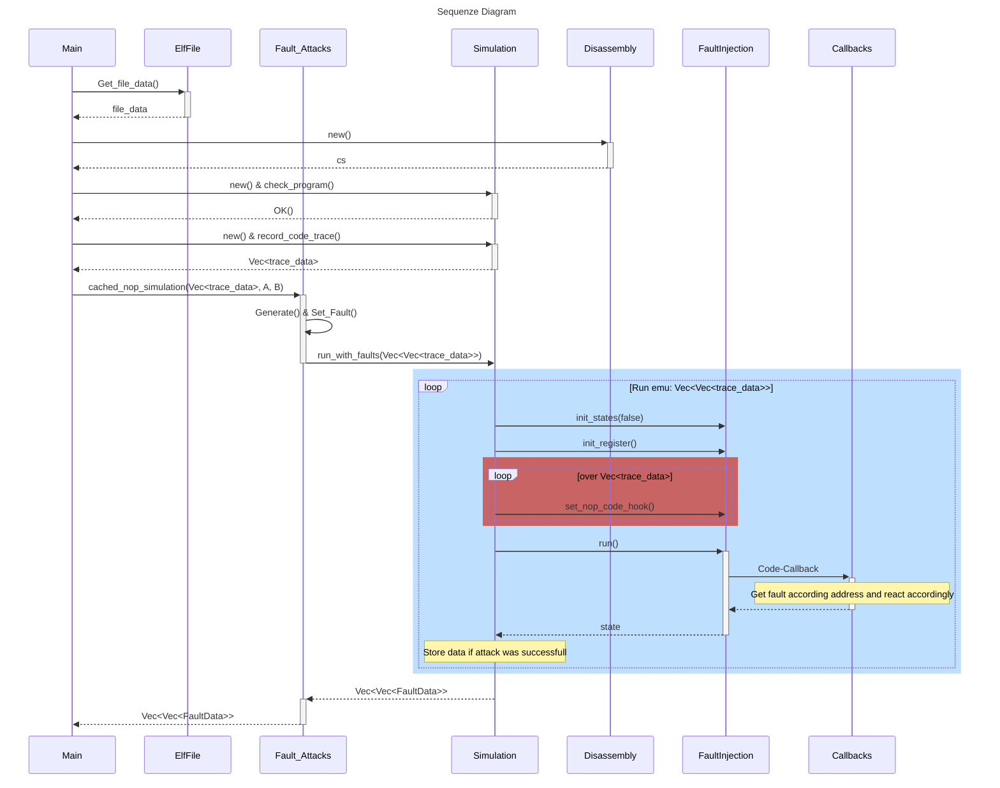

```mermaid
--- 
title: Sequenze Diagram 
---

sequenceDiagram
    participant Main
    participant ElfFile
    participant Fault_Attacks
    participant Simulation
    participant Disassembly
    participant FaultInjection
    participant Callbacks
    
    
    Main->>+ElfFile: Get_file_data()
    ElfFile-->>-Main: file_data
    Main->>+Disassembly: new()
    Disassembly-->>-Main: cs
    Main->>+Simulation: new() & check_program()
    Simulation-->>-Main: OK()
    Main->>+Simulation: new() & record_code_trace()
    Simulation-->>-Main: Vec<trace_data>
    Main->>+Fault_Attacks: cached_nop_simulation(Vec<trace_data>, A, B)
    Fault_Attacks->>Fault_Attacks: Generate() & Set_Fault()
    Fault_Attacks->>-Simulation: run_with_faults(Vec<Vec<trace_data>>)
    rect rgb(191, 223, 255)
    loop Run emu: Vec<Vec<trace_data>>
    Simulation->>FaultInjection: init_states(false)
    Simulation->>FaultInjection: init_register()
    rect rgb(200, 100, 100)
    loop over Vec<trace_data>
    Simulation->>FaultInjection: set_nop_code_hook()
    end
    end
    Simulation->>+FaultInjection: run()
    FaultInjection->>+Callbacks: Code-Callback
    note over Callbacks: Get fault according address and react accordingly
    Callbacks-->>-FaultInjection: 
    FaultInjection-->>-Simulation: state
    note over Simulation: Store data if attack was successfull
    end
    end
    Simulation-->>+Fault_Attacks: Vec<Vec<FaultData>>
    Fault_Attacks-->>-Main: Vec<Vec<FaultData>>
```